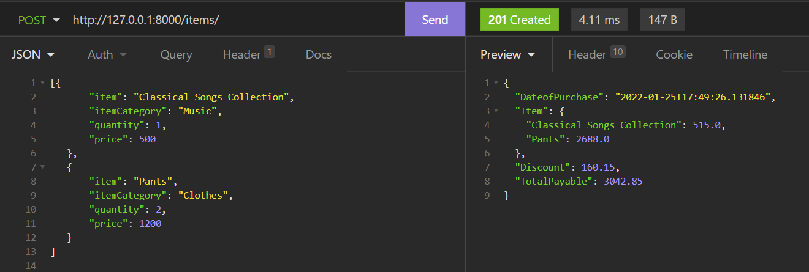

 _API built using Djangorestframework that computes the taxes and the final bill amount that can be used by All-in-One Store that sells everything from groceries, medicines, clothes, books, music CDs, imported commodities etc._ 

**STEPS TO RUN THIS PROJECT ON YOUR LOCAL MACHINE:** 

1.Clone this Repository (`git clone <URL>`)  
2.Move to the ANTStack Directory (`cd ANTStack`) 
3.Install all the dependencies (`pip install -r requirements.txt`)  
4.Makemigrations for the model (`python manage.py makemigrations`)  
5.Migrate the model (`python manage.py migrate`)  
6.Run Development server (`python manage.py runserver`)  
7.Use any API testing tool to test the API (_endpoint:_ `http://127.0.0.1:8000/items/`  _Method Supported:_ `POST`) 

**INPUT:** 

`[{
       "item": "Classical Songs Collection",
       "itemCategory": "Music",
       "quantity": 1,
       "price": 500
   },
   {
       "item": "Pants",
       "itemCategory": "Clothes",
       "quantity": 2,
       "price": 1200
   }]`

 **Calculation Done:** 

_Gets 1st Item "Classical Songs Collection" calculates totalPrice(assuming price given is for single quantity price*quantity)_  
_calculates tax for the totalPrice (500*0.03=15)_  
_so totalPrice after tax now is 500+15=515_  

_similarly calculates for next Item "Clothes" (totalPrice=2400 tax will be 12% as price exceeds 1000)_  
_totalPrice after tax now is 2400+288=2688 for the_  

_Calculates TotalBill = 2688+515 which exceeds 2000 so,5% discount is applied_  
_totalAmountPayable is TotalBill-Discount=3203-160.15=3042.85_  

 **OUTPUT:** 

`{
	"DateofPurchase": "2022-01-25T17:42:07.291825",
	"Item": {
		"Classical Songs Collection": 515.0,
		"Pants": 2688.0
	},
	"Discount": 160.15,
	"TotalPayable": 3042.85
}`

 Returns Items with totalcost after tax ,Discount and Total amount Payable 
  **Note: Items for sorted on ItemNames**  

 **Sreenshot:** 

